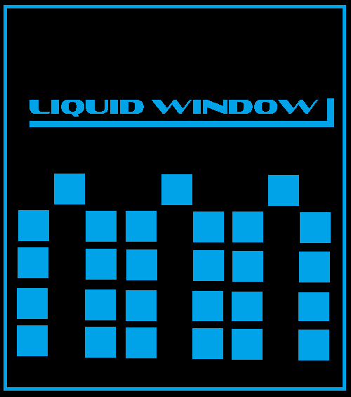
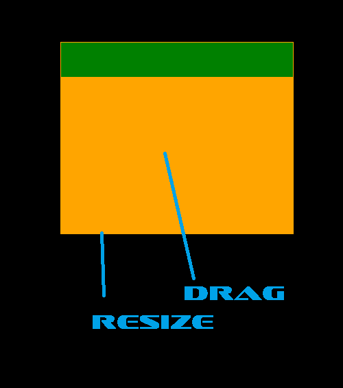

<h1 style = "color: rgb(0,162,232);" > Liquid Window <h1> 

<h3> Liquid Window is code that needs to be refactored into it's own class. It's my current effort to make a leight wieght class that allows for customization of the Title bar and the window itself. Currently the Title bar is simply a widget, drag functionality exists is in the main window area itself. I made this code to help you get going on this same journey. I invite you to clone, fork, and make pull requests. I welcome improvments and constructive critiques on my code. You're free to use this in your project.  </h3>

 

<h3> In its current state you can drage for movement, you can resize the window. </h3>

 

<h3 style = "color: green" > Liquid Window supports multiple monitors. </h3> 

 

<h3> Liquid Window is based on the resizeable widget code found at https://wiki.qt.io/Widget-moveable-and-resizeable but has been adapted for use as a upper level, parentless Widget. If you need a resizeable Widget this is where you want to go! This class/.h,.cpp file is called tcontiner is included in this repo for your refrence.
</h3>

 

<h1> Why this code is useful. </h1>

 

<h3> If your delving in QML or doing anything with Qt at somepoint you will want to customize the look of you application window. This will alow speedier learning and development and ultimately more customization of your applciation.
</h3>

 

<h2 style = "color: red" > Feel free to fork, create pull requests and improve on this code. Feel free to use it in your projects.

 

<h1> To Do List: </h1>
  
<ul>
<li> Take code out of MainWindow and create a custom LiquidWindow class. </li>
<li> Add a seperate class for the Title Bar </li>
<li> Add buttons to control Min/Max/Restore/Close to Title Bar.</li>
<li> Add functionality that will allow customization via QSS/CSS. </li>
<li> Add functions that will allow customization via C++ function calls. </li>
<li> Refactor Code in QMainWindow into Class LiquidWindow </li>
<li> Design a Cool Logo. </li>
</ul>

<h3> Credits:
 
<ul>
<li> Aleksey Osipov </li>
<li> Joe Farrish </li>
</ul>

